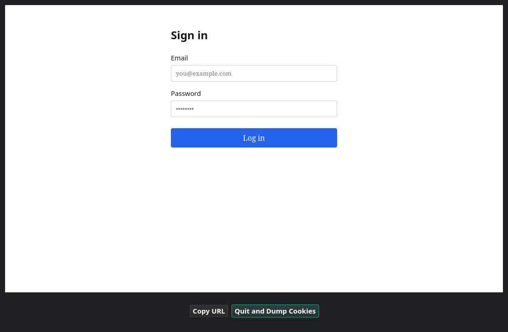
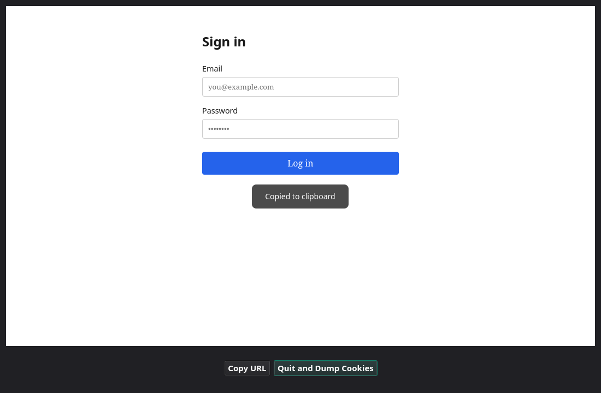

[](https://pypi.org/project/cookietruck/)
[](https://pypi.org/project/cookietruck/)

# Overview

Small toolkit for capturing and dumping browser cookies via an embedded browser and then being able to use them from cURL or any way you see fit.

This supports crawling or capturing authenticated web content.

# Requirements

Python **3.10** or newer (`requires-python` in `pyproject.toml`, aligned with PySide6).

# Install

From the repository root:

```bash
pip install .
```

# Build

From the repository root, install the build tooling (for example the `dev` extra, which includes `build` and `twine`), then run the packaging script:

```bash
pip install -e '.[dev]'
./infrastructure/build.sh
```

That runs `python -m build` and writes the wheel and sdist under `dist/`.

To publish those artifacts to PyPI (after configuring [twine](https://twine.readthedocs.io/) credentials), use:

```bash
./infrastructure/upload.sh
```

# Tools

## `ct_authenticate`

Opens an embedded Chromium window for the given URL. Log in as needed, then click **Quit and Dump Cookies** to print the session to stdout (redirect to a file). Optional flags include `--as-curl-cookiejar`, `--json-cookies-filepath`, and `--curl-cookies-filepath` for seeding or alternate export formats.



The window title shows the current page URL. **Copy URL** copies it to the clipboard and briefly shows a confirmation overlay:



## `ct_to_curl`

Reads JSON from `ct_authenticate` and prints `curl` cookie arguments (`-b` …).

## Example

```bash
ct_authenticate https://example.com > session.json
curl -s $(ct_to_curl < session.json) 'https://example.com/'
```

# Tests

```bash
pytest
```
